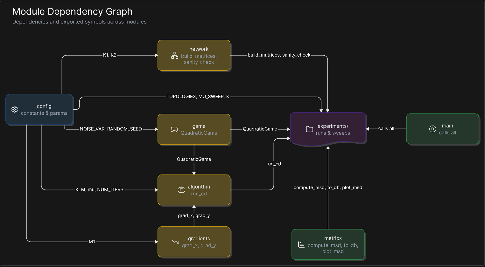

# Diffusion Learning in Different Network Topologies

Stability and performance analysis of the Competing Diffusion (CD) algorithm on two-network problems, for varying step sizes and graph topologies. Team project for *Distributed Optimization and Applications* (Master AI, PMF Novi Sad).

## Module map

```
config.py       — all hyperparameters (K1, K2, M, mu, topologies, sweep values)
game.py         — quadratic loss definition, stochastic observation generator
gradients.py    — stochastic grad_x and grad_y for the quadratic loss
algorithm.py    — CD main loop: ATC within-team diffusion + cross-team inference
network.py      — combination matrix construction (A1, A2, A21, A12, A11, A22)
metrics.py      — MSD computation, dB conversion, shared plot helper

experiments/
  reproduce_figure1.py  — reproduce paper Fig 1 (validates implementation)
  topology_test.py      — Fig 2: MSD vs topology
  stepsize_test.py      — Fig 3: MSD floor vs step size mu

results/
  figures/      — saved plots (.png)
  data/         — cached simulation outputs (.npy)

main.py         — runs all three experiments end-to-end
```

## Dependency graph



## Team

| Role | Owner | Files |
|---|---|---|
| Algorithm | Milica | `algorithm.py`, `gradients.py`, `game.py` |
| Network & Experiments | Luka | `network.py`, `config.py`, `metrics.py`, `experiments/`, `main.py` |
| Theory & Nash equilibrium | Marija | provides `z*`, valid `μ` range, `R_u` — handed to Milica and Luka |

## Simulation parameters (paper Section 4)

| Parameter | Value | Source |
|---|---|---|
| K₁ | 2 | paper |
| K₂ | 4 | paper |
| M₁ | 5 | paper |
| M₂ | 10 | paper |
| μ₁ | 0.001 (default) | paper Figure 1 |
| μ₂ | 0.0005 (= μ₁/2) | paper Figure 1 |
| Z_STAR | zeros(15) placeholder | @Marija to replace in config.py |
| R_U | I₁₅ per agent placeholder | @Marija to replace in config.py |

## Running

```bash
python main.py                            # all three figures
python -m experiments.reproduce_figure1
python -m experiments.topology_test
python -m experiments.stepsize_test
```

All scripts must be run from the project root directory.
